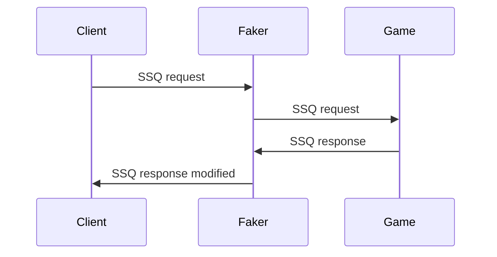

# Server query fake player count

This script allows you to change how many players are reported to Steam as online.
This is made possible by proxying [Steam Server Query](https://developer.valvesoftware.com/wiki/Server_queries) traffic through this program.
It modifies the A2S_INFO and A2S_PLAYER packets and passes all other packet types through untouched.

The project was originally made for DayZ, but may work with other titles, since the protocol is the same.

