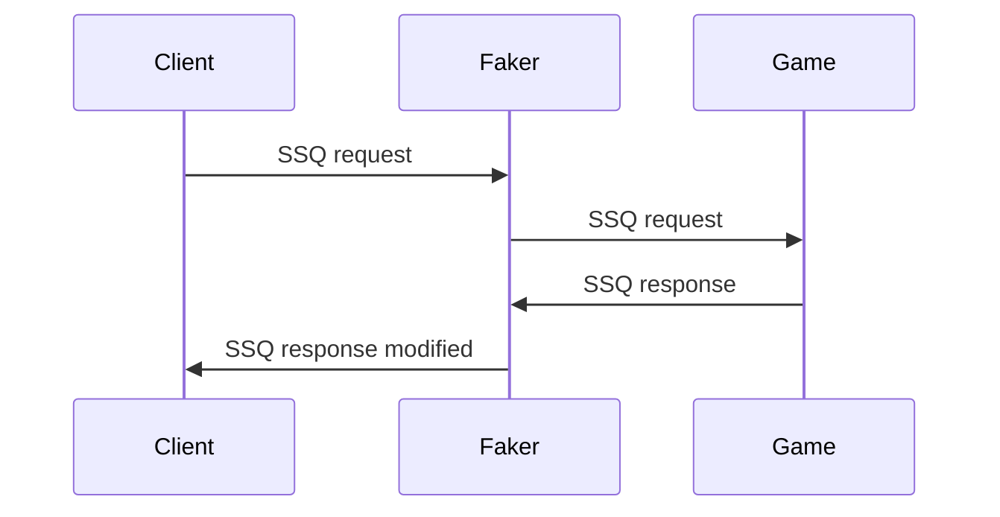

# Server query fake player count

This script allows you to change how many players are reported to Steam as online.
This is made possible by proxying [Steam Server Query](https://developer.valvesoftware.com/wiki/Server_queries) traffic through this program.
It modifies the A2S_INFO and A2S_PLAYER packets and passes all other packet types through untouched.

The project was originally made for DayZ, but may work with other titles, since the protocol is the same.

## Usage

| Parameter | Default | Description |
|---|---|---|
| `-address` | `localhost:27016` | the address of the original server |
| `-port` | `:27017` | what port to use as a proxy |
| `-amount` | `10` | how many players to add |
| `-verbose` | `false` | verbose logging |

Download the latest version of the program from the [Releases](https://github.com/anatolykopyl/server-query-fake-player-count/releases) page.

To use this script launch your DayZ server and ensure the port it runs on is blocked by the firewall (for example [UFW](https://help.ubuntu.com/community/UFW)).

Then launch `faker` with the `-address` parameter matching the address of your DayZ server. The `-port` parameter is the new port of your server that the players will connect to. It has to be opened in the firewall.
