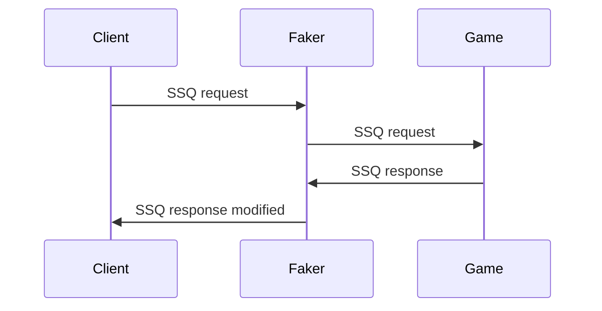
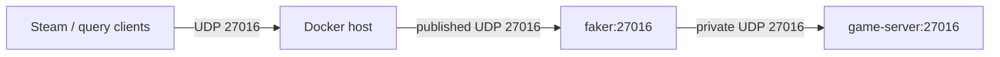

# Server query fake player count

This script allows you to change how many players are reported to Steam as online.
This is made possible by proxying [Steam Server Query](https://developer.valvesoftware.com/wiki/Server_queries) traffic through this program.
It modifies the A2S_INFO and A2S_PLAYER packets and passes all other packet types through untouched.

The project was originally made for DayZ, but may work with other titles, since the protocol is the same.


```mermaid
sequenceDiagram

  Client->>Faker: SSQ request
  Faker->>Game: SSQ request
  Game->>Faker: SSQ response
  Faker->>Client: SSQ response modified
```

## Usage

| Parameter | Default | Description |
|---|---|---|
| `-address` | `localhost:27016` | the address of the original server |
| `-port` | `:27017` | UDP address to listen on |
| `-amount` | `10` | how many players to add |
| `-verbose` | `false` | verbose logging |

Download the latest version of the program from the [Releases](https://github.com/anatolykopyl/server-query-fake-player-count/releases) page.

## Port arrangement

The Steam query endpoint advertised by the game server must lead to the faker. The original query endpoint must remain reachable by the faker at a private address, but it must not be reachable directly from the internet.

For DayZ, the advertised endpoint is controlled by `steamQueryPort` in `serverDZ.cfg`. The faker only proxies query traffic; `-port` is not a gameplay port.

### Recommended: Docker Compose

Run the game server and faker in separate containers on the same Docker bridge network. Separate network namespaces let both processes listen on the same UDP port without a conflict. The game server must not use `network_mode: host`, because that would put it back in the host's network namespace:


```mermaid
flowchart LR
  Steam[Steam / query clients] -->|UDP 27016| Host[Docker host]
  Host -->|published UDP 27016| Faker[faker:27016]
  Faker -->|private UDP 27016| Game[game-server:27016]
```

Set the DayZ query port to the same value used by the Compose deployment:

```cpp
steamQueryPort = 27016;
```

The example in [`examples/compose.yaml`](examples/compose.yaml) provides the network and faker configuration. Add your game server's existing volumes, environment, command, and gameplay port mappings to the `game-server` service, then launch it:

```sh
cp examples/.env.example examples/.env
# Set GAME_SERVER_IMAGE and any game-specific configuration first.
docker compose --env-file examples/.env -f examples/compose.yaml up -d --build
```

The game server's query port is exposed only to the private Compose network. Only the faker publishes that port to the host. If the host is behind NAT, forward the same external UDP port to the same port on the Docker host (for example, `27016 -> 27016`). Cloud firewalls or security groups must allow that UDP port as well.

The container image is also published to `ghcr.io/anatolykopyl/server-query-fake-player-count`. To use the published image instead of building locally, replace the `build` section of the `faker` service with:

```yaml
image: ghcr.io/anatolykopyl/server-query-fake-player-count:latest
```

### Native process

When the game server and faker run in the same network namespace, they cannot bind the same address and port. Use a private port for the original server and make sure the public port advertised by the game terminates at the faker. For example:

```text
DayZ steamQueryPort:       27016
Faker upstream:            127.0.0.1:27016
Faker listener:            0.0.0.0:27017
Router/NAT port mapping:   public 27016/udp -> host 27017/udp
```

Launch the faker with `-address=127.0.0.1:27016 -port=:27017`. Firewall rules must block direct public access to the original query endpoint while still allowing the faker to reach it.
